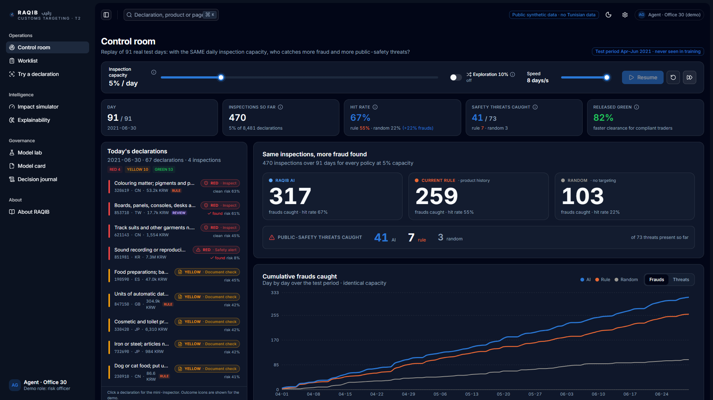
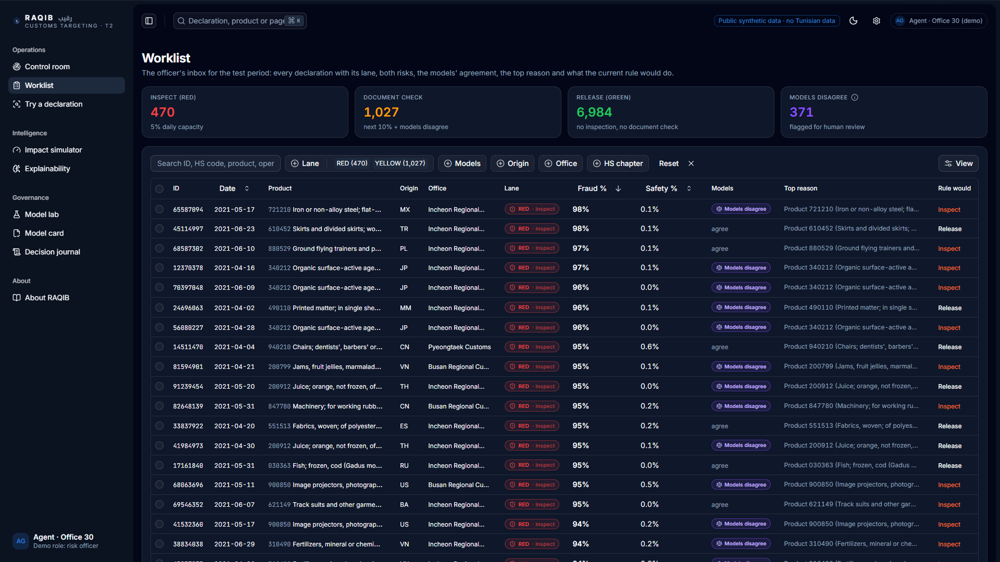
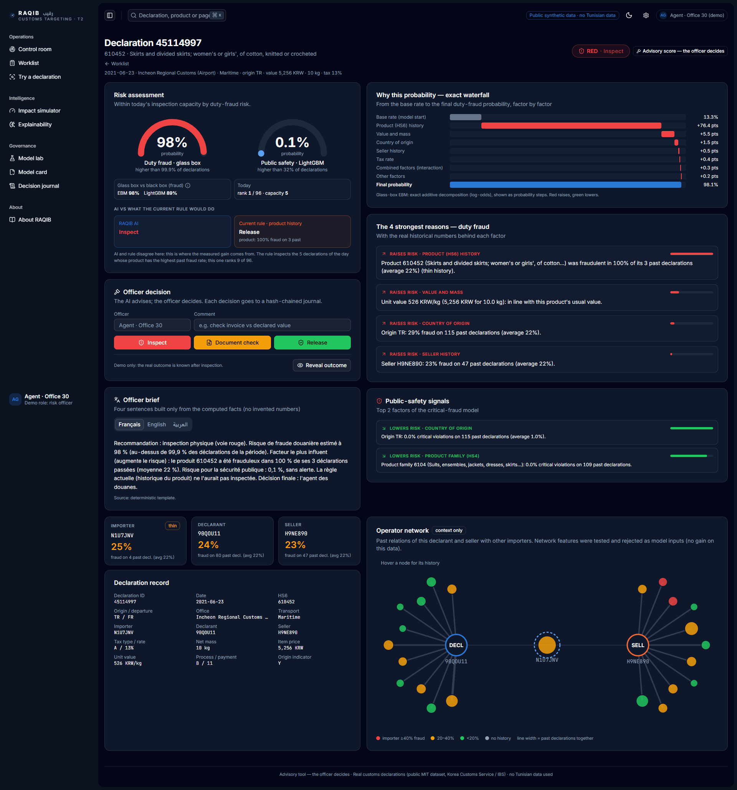
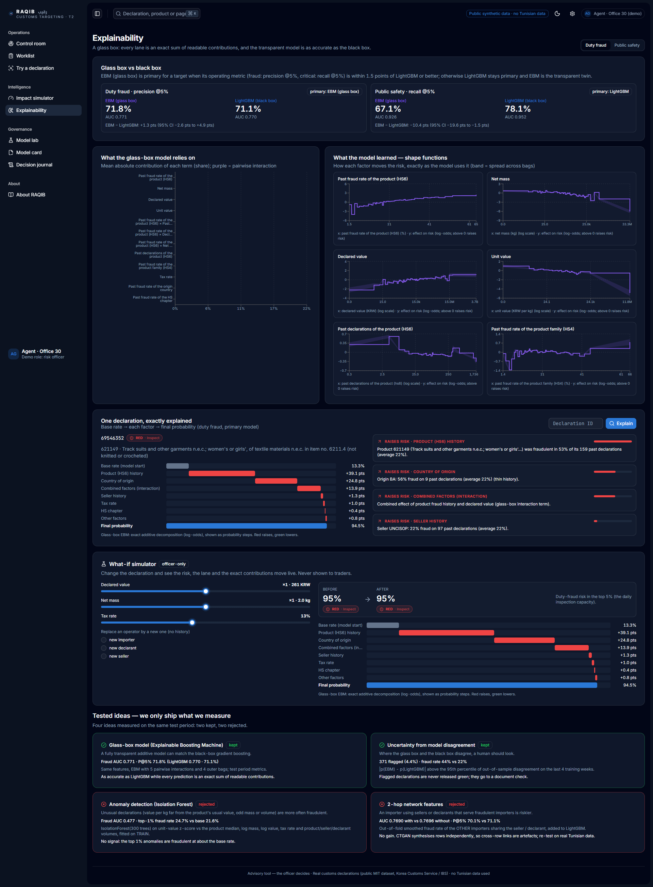
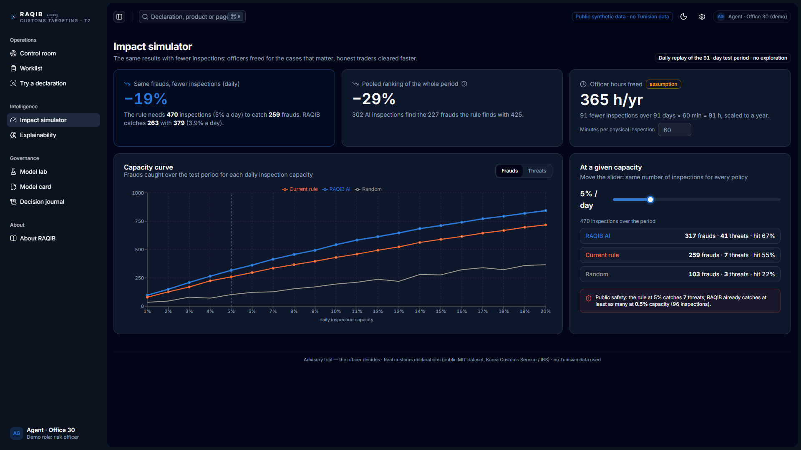

# RAQIB · رقيب — AI targeting of customs controls

**Challenge T2 « Ciblage et orientation automatisés des contrôles »** — hackathon *IA & Finances Publiques*
(École Nationale des Douanes · École Nationale des Finances, Tunisia, 2026).

RAQIB decides which import declarations customs should physically inspect under a **fixed daily inspection
capacity**. It scores every declaration for **duty fraud** (revenue) and **critical fraud** (public safety),
fills the capacity (safety alerts first, then the highest fraud risk, plus optional exploration), gives each
declaration a lane — **RED** inspect · **YELLOW** document check · **GREEN** release — with four plain-English
reasons, shows what today's best rule would have done, and leaves the decision to the officer, who is logged in
a tamper-evident journal.

<!-- BEGIN:pitch -->
With the same 470 inspections over 91 test days (5% of declarations), RAQIB catches **317 frauds and 41 public-safety threats**, against 259 and 7 for the best current rule (product history) and 103 and 3 at random: **+58 frauds (+22%) and 5.9x the threats**, same workload.

**Same frauds with fewer inspections:** the rule needs 470 inspections (5% a day) to catch 259 frauds; RAQIB catches 263 with 379 (3.9% a day): **19% fewer inspections** (pooled ranking: 302 vs 425, 29% fewer).

**Glass box, no accuracy lost:** the transparent EBM reaches duty-fraud AUC 0.771 and precision @5% 71.8% vs 0.770 / 71.1% for the black-box LightGBM; primary model: fraud = EBM, critical = LIGHTGBM.

**When the two models disagree, RAQIB asks a human:** 371 test declarations (4.4%) are flagged, with a fraud rate of 44% (average 22%); 136 of them move from GREEN to a document check.
<!-- END:pitch -->



## Run it (one command)

| System | Command | Then open |
|---|---|---|
| Windows | `run_demo.bat` (double-click) | http://127.0.0.1:8000 (opens automatically) |
| Git Bash / macOS / Linux | `./run_demo.sh` | http://127.0.0.1:8000 |

The script creates the Python environment if needed, downloads the two public datasets, builds the models and
the measured results (about 15 s on a laptop CPU), builds the web app if `frontend/dist` is missing, then serves
everything on one port. Requirements: Python 3.11+ and Node.js 20+ (pnpm through `corepack`, or npm).
Everything works offline once built (fonts are self-hosted).

Manual steps (Windows, Git Bash):
```bash
py -3.12 -m venv .venv && .venv/Scripts/pip install -r requirements.txt && .venv/Scripts/pip install -e .
.venv/Scripts/python -m raqib.build           # data -> models -> metrics -> explanations -> replay
.venv/Scripts/python -m raqib.report          # regenerate README numbers and docs/*.md from the artifacts
cd frontend && corepack pnpm install && corepack pnpm build && cd ..
.venv/Scripts/python -m raqib.serve --open    # add --lan to open the demo from a phone on the same Wi-Fi
```
Front-end development: `python -m raqib.serve` + `cd frontend-v2 && corepack pnpm dev` (http://localhost:5174, `/api` proxied; v1: `cd frontend`, port 5173).

## Screenshots (v2 web app)

| Worklist | Inspector (exact waterfall, brief FR/EN/AR) |
|---|---|
|  |  |
| **Explainability (glass box, what-if, tested ideas)** | **Impact simulator** |
|  |  |

The v1 control room (`frontend/`) is kept as a fallback: `python -m raqib.serve --ui v1` (screenshots in docs/screenshots/).

## Measured results (test period, never used for training)

<!-- BEGIN:results -->
| Method | Fraud AUC | Fraud precision @1% | @5% | @10% | Critical AUC | Critical recall @1% | @5% | @10% |
|---|---:|---:|---:|---:|---:|---:|---:|---:|
| RAQIB AI | 0.771 | 84.7% | 71.8% | 61.4% | 0.952 | 52.1% | 78.1% | 84.9% |
| Rule: product (HS6) history | 0.728 | 57.6% | 53.4% | 48.6% | 0.924 | 26.0% | 54.8% | 75.3% |
| Rule: importer history | 0.513 | 20.0% | 18.8% | 19.7% | 0.516 | 0.0% | 1.4% | 6.8% |
| Random | 0.497 | 24.7% | 21.4% | 20.4% | 0.548 | 0.0% | 6.8% | 13.7% |

- Duty fraud precision @5%: 71.8% vs 53.4% for the rule: +17.8 pts (95% bootstrap CI +12.5 pts to +22.5 pts).
- Public-safety recall @5%: 78.1% vs 54.8%: +22.5 pts (95% CI +13.3 pts to +32.3 pts); 73 critical cases only, so ±5 pts (1 s.e.).
- Stable: the AI beats the rule in 12 of 13 weeks (precision @5% within each week).
- Calibrated: in the riskiest tenth of declarations the model predicts 61.7% fraud and 61.4% is observed.
<!-- END:results -->

### Daily replay — same capacity for every policy (5% of each day's declarations)

<!-- BEGIN:replay -->
| Policy (same inspections every day) | Inspections | Frauds caught | Threats caught | Hit rate | Distinct products inspected |
|---|---:|---:|---:|---:|---:|
| RAQIB AI | 470 | 317 | 41 | 67.4% | 261 |
| RAQIB AI + exploration | 470 | 294 | 41 | 62.6% | 280 |
| Current rule (product history) | 470 | 259 | 7 | 55.1% | 163 |
| Random | 470 | 103 | 3 | 21.9% | 309 |
<!-- END:replay -->

All numbers above are generated by `python -m raqib.report` from `artifacts/metrics.json`; nothing is typed by
hand. Full tables: [docs/RESULTS.md](docs/RESULTS.md).

## Local LLM (optional, offline)

RAQIB can use a **local** Qwen3-4B model through [Ollama](https://ollama.com/download) — no API key, no internet, no
declaration data leaves the laptop. It is optional: with `RAQIB_LLM=off` (or Ollama not running) everything works in
template / rule mode.

```bash
ollama pull qwen3:4b-instruct   # Qwen3-4B instruct (non-thinking), ~2.5 GB, fits a 4 GB GPU
set RAQIB_LLM=ollama                          # default: on if Ollama answers at start-up, else off
.venv/Scripts/python scripts/eval_llm.py      # measures it -> artifacts/llm_eval.json
```

What it does — and only this:
- **Officer brief** (FR / AR / EN): rephrases facts already computed by the models (lane, probabilities, the 4 reasons,
  the rule's decision). A number guard rejects any number that is not in the facts, and accusatory wording is banned;
  otherwise the deterministic template is used.
- **Ask RAQIB**: turns a question ("déclarations rouges d'origine CN au chapitre 85 au-dessus de 80%") into a strict
  worklist filter, validated against the real data and shown as chips; the officer clicks Apply. A rule-based parser
  is always available.

- **Assistant RAQIB** (floating button, every page): a grounded helper chat in FR / AR / EN that explains RAQIB and the open declaration from a generated knowledge base (`docs/assistant_kb.md`) and the computed facts, with the same number guard; out-of-scope questions are refused; FAQ mode when the LLM is off.

What it never does: score, rank, choose a lane, raise an alert or decide. Measured numbers are in the Model card page
(and artifacts/llm_eval.json).

## Architecture

```
  Public data (MIT / PDDL)                 python -m raqib.build   (~15 s, CPU only)
 +---------------------------+   +--------------------------------------------------------------+
 | Customs declarations CSVs |-->| data.py      loaders, HS names, data card                    |
 | HS nomenclature CSV       |   | model.py     out-of-fold target encoding + LightGBM x2       |
 +---------------------------+   |              + isotonic calibration                          |
                                 | baselines.py random / importer history / HS6 history rules   |
                                 | evaluate.py  AUC, precision/recall@k, CI, calibration, weekly |
                                 |              fairness, ablation   -> artifacts/metrics.json   |
                                 | explain.py   TreeSHAP -> 4 plain-English reasons              |
                                 | replay.py    day-by-day capacity replay (AI/explore/rule/rnd) |
                                 +------------------------------+-------------------------------+
                                                                | artifacts/ (models, parquet, json)
                                                                v
  Browser (React control room) <--- HTTP /api ---> FastAPI (api.py, engine.py, score.py)
  Control room · Inspector ·                        replay · stream · declaration · score ·
  Try a declaration · Model lab · About             presets · HS search · decisions (SHA-256 chain)
```

## How the AI works

1. **Targets**: `fraud` = Fraud column; `critical` = Critical Fraud == 2 (serious violation, e.g. unsafe goods).
2. **Risk history features**: for HS6, HS4, HS2, importer, declarant, seller, origin and office, the smoothed
   rate `(sum + a*prior) / (count + a)` and the count (a = 10 for fraud, 20 for critical), computed
   **out-of-fold** on the training period (5 folds) so no row ever sees its own label; test and new
   declarations use full-training statistics. Plus tax rate, net mass, value and `log1p(value / mass)`.
3. **Models**: LightGBM (300 trees, learning rate 0.03, 15 leaves, 100 min samples per leaf, bagging 0.8).
4. **Calibration**: isotonic regression on out-of-fold training predictions → probabilities.
5. **Daily allocation**: capacity = ceil(rate × declarations of the day), identical for every policy;
   public-safety alerts (top 1% critical risk) first, then the highest fraud risk; optional exploration.
6. **Explanations**: exact TreeSHAP (`pred_contrib`) grouped by concept, top 4, with the real historical numbers.

## Data and licences

- **Customs Import Declaration Datasets** (Institute for Basic Science & Korea Customs Service, **MIT**):
  54,000 synthetic declarations (CTGAN) from real inspected declarations, 22 attributes. Train = train + valid
  files (2020-01-01 → 2021-03-31, 45,519 rows); test = test file (2021-04-01 → 2021-06-30, 8,481 rows).
- **datasets/harmonized-system** (**ODC-PDDL**): product names.
- No Tunisian data; no scraping; no contact with any administration system. Every library is listed with its
  licence in [THIRD_PARTY.md](THIRD_PARTY.md).

## Honest limits

- Only inspected declarations were synthesised: the fraud rate (≈ 22%) is far above reality, so absolute
  precision is optimistic. **What we claim is the gain over the rule on the same data.**
- Only 73 critical cases in the test period: recall figures carry a standard error of about ±5 points.
- Value and mass carry signal in this dataset, but most test declarations have exactly their product's usual
  unit value (a synthetic artefact): value signals must be re-validated on real data (ablation in docs/RESULTS.md).
- Learning only from inspected declarations creates selection bias: exploration and a control group correct it.
- Alert and lane thresholds are set on the test period; in production they come from the previous weeks.

## Repository layout

```
backend/raqib/   pipeline + API (config, data, model, baselines, evaluate, explain, replay, score,
                 engine, decisions, build, report, api, serve)
frontend/        Vite + React + TypeScript + Tailwind control room
tests/           pytest (pipeline + API) and tests/e2e/smoke_ui.py (Playwright, optional)
docs/            NOTE_DRAFT.md, DECK_OUTLINE.md, DEMO_SCRIPT.md, RESULTS.md, screenshots/
API.md           every JSON shape of the HTTP API
```

## Tests

```bash
.venv/Scripts/python -m pytest -q                  # pipeline + API (builds artifacts if missing)
.venv/Scripts/python tests/e2e/smoke_ui.py         # optional: server running; drives Edge/Chrome, fails on console errors
cd frontend && corepack pnpm lint && corepack pnpm build
```

## Documents

- [docs/NOTE_DRAFT.md](docs/NOTE_DRAFT.md) — note de synthèse (draft, 2 pages)
- [docs/DECK_OUTLINE.md](docs/DECK_OUTLINE.md) — 12 slides with the exact numbers and speaker notes
- [docs/DEMO_SCRIPT.md](docs/DEMO_SCRIPT.md) — the 10-minute jury passage, minute by minute
- [API.md](API.md) · [THIRD_PARTY.md](THIRD_PARTY.md) · [PROGRESS.md](PROGRESS.md)

Precedent: the World Customs Organization's BACUDA project (Korea Customs Service + Institute for Basic
Science) built the DATE model (KDD 2020) and piloted machine-learning targeting with Nigeria Customs in 2020;
the dataset used here comes from that ecosystem.

*Advisory tool: the officer decides.*
